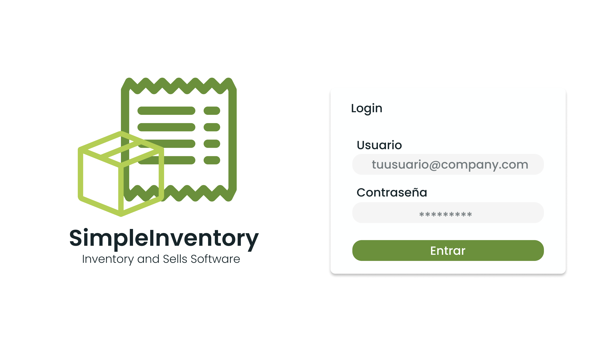

# SimpleInventory
A simple inventory management software with clients support and reports generation, with an interface as clean as possible and a elegant and useful Python backend
makes this project a pretty simple example for CS classes or academic purposes .

## Login 

## Products

